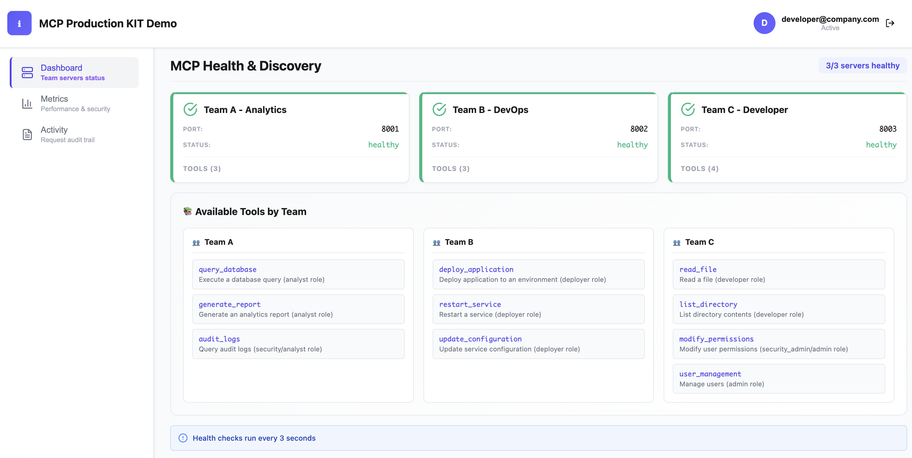

# 🛡️ MCP Production Toolkit

Enterprise Security, Reliability & Observability for Model Context Protocol

## Live Demo:
[Click Here](https://www.youtube.com/live/mPcla3P5ObA?si=6eUGWCD84Jh-IbMB&t=678)

## 🚀 Quick Start (2 min)

```bash
# Start all services
docker-compose up -d

# Open dashboard → http://localhost:5173
docker-compose ps
```

**Login:** See [CREDENTIALS.md](docs/CREDENTIALS.md)



## 📚 Documentation

| What | Link | Time |
|------|------|------|
| **Setup & install** | [INSTALLATION.md](docs/INSTALLATION.md) | 5 min |
| **Credentials & env** | [CREDENTIALS.md](docs/CREDENTIALS.md) | 3 min |
| **Architecture** | [TEAMS.md](docs/TEAMS.md) | 10 min |
| **Available tools** | [TOOLS.md](docs/TOOLS.md) | 5 min |
| **Docker commands** | [DOCKER_QUICK_REFERENCE.md](docs/DOCKER_QUICK_REFERENCE.md) | 2 min |
| **All docs** | [INDEX.md](docs/INDEX.md) | - |

## 🎯 Services

| Service | Port | Purpose |
|---------|------|---------|
| **Dashboard** | 5173 | Web UI & monitoring |
| **Gateway** | 3000 | API & security layer |
| **Team A** | 8001 | Analytics tools |
| **Team B** | 8002 | DevOps tools |
| **Team C** | 8003 | Developer tools |

## ✨ Features

- **Zero-Trust Security** - JWT auth, RBAC, prompt injection detection
- **Enterprise Reliability** - Circuit breaker, retries, health checks
- **Full Observability** - Real-time dashboard, request logging, metrics
- **Multi-Team Support** - 3 independent servers, dynamic routing

## 🧪 Test It

```bash
# Get token
TOKEN=$(curl -s -X POST http://localhost:3000/auth/token \
  -H "Content-Type: application/json" \
  -d '{"email":"developer@company.com","password":"YOUR_PASSWORD"}' | jq -r .access_token)

# Call a tool
curl -X POST http://localhost:3000/mcp/tools/list_directory \
  -H "Authorization: Bearer $TOKEN" \
  -H "Content-Type: application/json" \
  -d '{"arguments":{"path":"/tmp"}}'
```

## 📁 Project Structure

```
docs/                 ← All documentation
gateway/              ← TypeScript security layer
dashboard/            ← React web UI
mcp_server/           ← Python FastMCP servers
.env.local            ← Your credentials (git-ignored)
.env.example          ← Template for .env.local
```

## ⚡ Common Commands

```bash
# View logs
docker-compose logs -f gateway

# Restart a service
docker-compose restart gateway

# Stop everything
docker-compose down

# Helper script
./docker-run.sh up|down|logs|test
```
